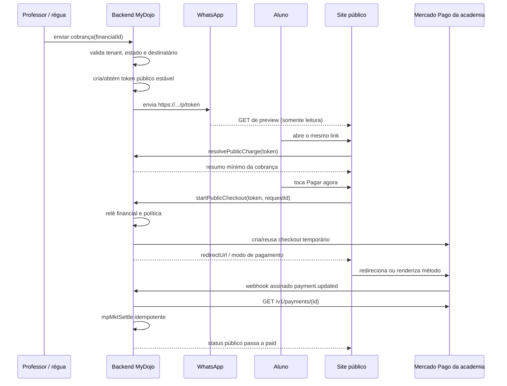
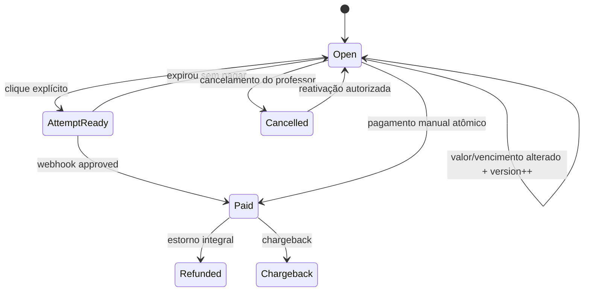

# 01 — Arquitetura-alvo do pagamento público

## 1. Jornada desejada



## 2. Componentes

### 2.1. Site público

Implementação leve em `site/pay/`, separada do Flutter:

- carrega rápido em celular simples;
- não inicializa Firebase Auth;
- não contém segredo;
- não lê Firestore diretamente;
- exibe apenas academia, descrição segura, valor, vencimento e estado;
- faz polling curto após retorno do Mercado Pago e oferece atualização manual;
- nunca cria checkout no carregamento;
- usa `noindex,nofollow`, CSP, `Referrer-Policy: no-referrer` e
  `Cache-Control: no-store` para respostas da cobrança.

Rota pública proposta:

```text
GET https://bjjeasy.netlify.app/p/<rawToken>
```

`site/netlify.toml` faz rewrite de `/p/*` para o shell estático e proxy das
chamadas `/api/public-pay/*` para Cloud Functions. O token continua no path para
ser compartilhável; o backend recebe somente via TLS e nunca o registra.

### 2.2. API pública Firebase

Endpoints v2 `onRequest`, separados do webhook:

#### `resolvePublicCharge`

```http
POST /api/public-pay/resolve
Content-Type: application/json

{ "token": "<rawToken>" }
```

Resposta pública:

```json
{
  "status": "open",
  "academy": { "displayName": "Drakkar", "logoUrl": "https://..." },
  "charge": {
    "description": "Mensalidade de agosto",
    "amount": 120.00,
    "currency": "BRL",
    "dueDate": "2026-08-10",
    "studentDisplayName": "Igor"
  },
  "availableMethods": ["pix", "credit_card"],
  "version": 3
}
```

Estados públicos: `open`, `paid`, `cancelled`, `unavailable`. Não devolver
`academyId`, `financialId`, CPF, e-mail, telefone, endereço, IDs do Mercado Pago
ou dados completos do aluno.

#### `startPublicCheckout`

```http
POST /api/public-pay/start
Content-Type: application/json
Origin: https://bjjeasy.netlify.app

{
  "token": "<rawToken>",
  "requestId": "<uuid-v4>",
  "method": "auto",
  "expectedVersion": 3
}
```

O backend:

1. valida formato e hash do token;
2. aplica rate limit;
3. relê o `financial` autoritativo;
4. exige estado `pending|overdue` e valor positivo;
5. valida versão/valor para impedir checkout stale;
6. resolve o token OAuth da academia;
7. adquire lock transacional de criação;
8. cria ou reaproveita uma tentativa compatível;
9. persiste a tentativa antes de responder;
10. retorna `redirectUrl` e `attemptId`, nunca access token.

Resposta:

```json
{
  "status": "ready",
  "attemptId": "attempt_...",
  "checkoutMode": "checkout_pro",
  "redirectUrl": "https://www.mercadopago.com.br/checkout/v1/redirect?..."
}
```

`requestId` é idempotente dentro do token. Dois cliques ou retries do mesmo POST
retornam a mesma tentativa.

#### `publicChargeStatus`

Pode ser o mesmo `/resolve`, com cache desabilitado. Não consultar Mercado Pago
a cada polling; o Firestore atualizado pelo webhook é a fonte de leitura.

## 3. Estratégia por política de método

O contrato atual possui `both`, `pix_only` e `card_only`. A solução não pode
silenciosamente descumpri-lo.

| Política | Jornada pública alvo | Observação |
|---|---|---|
| `both` | Checkout Pro | Convidado escolhe Pix/cartão no MP. |
| `pix_only` | Pix dinâmico criado após o clique | Mostra copia-e-cola/QR dentro da página MyDojo; se expirar, o mesmo link cria outro. |
| `card_only` | Payment Brick/cartão tokenizado no navegador | Reaproveita `createMpCardPaymentCore`; PAN/CVV nunca passa pelo backend. |

O MVP pode ativar primeiro `both` e `pix_only`, mas não deve degradar
`card_only` para “qualquer método”. Enquanto o fluxo público de cartão não
estiver pronto, a página informa que o pagamento deve ser concluído no app ou
com a academia. A Definition of Done só fica completa quando `card_only` também
estiver disponível sem login.

## 4. Preferência Checkout Pro

Campos mínimos derivados no servidor:

```json
{
  "items": [{
    "id": "financial",
    "title": "Mensalidade",
    "currency_id": "BRL",
    "quantity": 1,
    "unit_price": 120.00
  }],
  "external_reference": "<academyId>:fin:<financialId>",
  "notification_url": "<webhook>?acad=<academyId>",
  "back_urls": {
    "success": "https://bjjeasy.netlify.app/p/<token>",
    "pending": "https://bjjeasy.netlify.app/p/<token>",
    "failure": "https://bjjeasy.netlify.app/p/<token>"
  },
  "auto_return": "approved",
  "expires": true,
  "expiration_date_from": "<agora>",
  "expiration_date_to": "<janela curta>",
  "date_of_expiration": "<no mínimo 3 dias para Pix>"
}
```

Regras:

- O access token usado é sempre o da academia, obtido por OAuth.
- `marketplace_fee` é omitido enquanto a plataforma não cobrar comissão.
- Título e descrição são saneados e não carregam PII.
- A preferência tem vida curta; o **link MyDojo** não.
- Preferência antiga só é reusada se `financialVersion`, valor, política e
  validade ainda coincidirem.
- Alteração de valor/vencimento incrementa `financialVersion` e invalida todas
  as tentativas abertas, com cancelamento/expiração best-effort no MP.

## 5. Modelo de dados

### 5.1. Link global opaco

```text
publicPaymentLinks/{sha256(rawToken)}
```

```yaml
academyId: string
targetType: financial
targetId: string
status: active | revoked
financialVersion: number
createdAt: timestamp
updatedAt: timestamp
revokedAt: timestamp?
lastResolvedAt: timestamp?   # amostrado, não escrever em todo GET
```

- Token bruto aleatório de 32 bytes, Base64URL sem padding.
- Apenas o hash é armazenado.
- Documento global é server-only.
- Um `financial` tem no máximo um link ativo; retries de criação devolvem o
  mesmo link.
- O token pode ser revogado e substituído em incidente de privacidade.

### 5.2. Tentativas de checkout

```text
academies/{academyId}/paymentAttempts/{attemptId}
```

```yaml
targetType: financial
targetId: string
publicLinkHash: string
financialVersion: number
provider: mercadopago
mode: checkout_pro | pix | card
providerPreferenceId: string?
providerPaymentId: string?
requestIdHash: string
amount: number              # reais
currency: BRL
status: creating | ready | pending | approved | expired | cancelled | failed
createdAt: timestamp
expiresAt: timestamp?
updatedAt: timestamp
failureCode: string?
```

O documento de tentativa é auditoria técnica, não o ledger. O `financial` segue
sendo a verdade da dívida; o pagamento aprovado e o webhook são a verdade da
liquidação.

### 5.3. Campos novos no financial

```yaml
financialVersion: 1
publicPaymentLinkHash: string?  # server-only; opcional para lookup reverso
publicPaymentEnabled: true
lastCheckoutAttemptId: string?
```

Campos Pix atuais permanecem durante a compatibilidade, mas deixam de ser o
contrato da mensagem de WhatsApp. Depois do corte, podem ser movidos para
`paymentAttempts` e removidos do modelo principal numa migração separada.

## 6. Estados e transições



Regras invariantes:

- `paid`, `refunded` e `chargeback` são estados financeiros terminais no cliente.
- Link `paid|cancelled` nunca cria nova tentativa.
- Aprovação tardia em cobrança já paga manualmente entra no fluxo de duplicidade
  e alerta para reembolso; nunca é descartada silenciosamente.
- Webhook é idempotente por `providerPaymentId`.
- Valor divergente nunca liquida automaticamente.

## 7. Cobrança pelo WhatsApp

O template futuro usa um bloco genérico:

```text
[[PAYMENT]]
Pague com segurança por Pix ou cartão:
{link_pagamento}
[[/PAYMENT]]
```

Compatibilidade temporária:

- backend entende `{link}`, `{link_pagamento}`, `[[PIX]]` e `[[PAYMENT]]`;
- mensagem nova não envia `{pix}` por padrão;
- configurações antigas `includePaymentLink=true` equivalem a
  `paymentLinkMode=mydojo` quando a feature flag da academia estiver ativa;
- `legacy_pix` existe somente para rollback durante o canário.

Envio unitário, lote manual, cobrança na criação e crons usam o mesmo serviço
`BillingDispatchService`, eliminando quatro jornadas divergentes.

## 8. O que acontece quando a cobrança é reenviada

- O mesmo `financial` recebe o mesmo link MyDojo.
- Não se cria pagamento apenas por reenviar.
- Se o aluno abrir e a tentativa antiga estiver viva/compatível, ela é reusada.
- Se estiver expirada, o clique cria outra tentativa.
- Se já estiver paga, o link mostra confirmação e não oferece pagamento.
- Se o valor mudou, a versão invalida a tentativa antiga e o link mostra o valor
  atual antes de permitir novo checkout.

